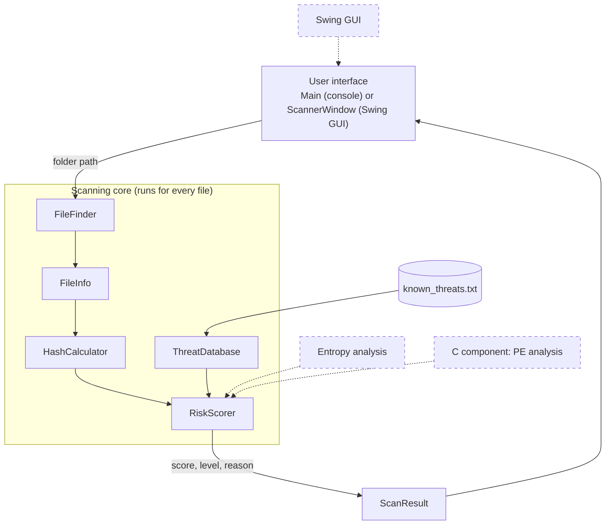

# SentinelScan Architecture

SentinelScan is a static file scanner written in Java. It looks at files, calculates their SHA-256 hash, compares the hash with a local list of test hashes, and gives each file an explainable risk score.

**It produces risk indicators, not a malware verdict.** A LOW score does not mean a file is safe, and a HIGH score only means the rules matched.

## 1. Overview



Dashed boxes are planned and not implemented yet.

## 2. Components

| Class | Responsibility | Status |
|---|---|---|
| `Main` | Asks for a folder, runs the scan, builds the list of results, prints them | Done |
| `FileFinder` | Finds all files in a folder and its subfolders (recursion), sorted; counts folders scanned and skipped | Done |
| `FileInfo` | Holds details of one file: name, path, size, extension, created/modified/accessed times | Done |
| `HashCalculator` | Calculates the SHA-256 of a file by reading it in 8 KB chunks | Done |
| `ThreatDatabase` | Loads `known_threats.txt` into a `HashMap` and answers "is this hash in the list?" | Done |
| `RiskScorer` | Applies the scoring rules and keeps a written reason for each rule that matched | Done |
| `ScanResult` | Holds everything about one scanned file: `FileInfo`, hash, score, risk level, reason | Done |
| `ScannerWindow` | Swing window with folder selection, Start Scan, progress bar, counters, results table and details area. Scanning runs in a background `SwingWorker` | Done |
| `ScanService` | Scans one file (info, hash, score) and returns a `ScanResult`; used by the GUI | Done |
| C component | Low-level analysis such as PE header parsing | Planned |
| Entropy and extra heuristics | More scoring rules | Planned |
| History and report export | Save and export scan results | Planned |

## 3. Data flow

1. The user enters a folder path.
2. `Main` checks that the path exists and is a folder.
3. `Main` asks `ThreatDatabase` to load `known_threats.txt`.
4. `FileFinder` walks through the folder and all subfolders and returns a sorted list of files.
5. For each file:
   1. `FileInfo` reads the size, extension and timestamps.
   2. `HashCalculator` calculates the SHA-256.
   3. `RiskScorer` checks the rules, using `ThreatDatabase` for the hash lookup.
   4. `Main` stores everything in a `ScanResult`.
6. `Main` prints every result and a summary (file count, total size, number of files per risk level, folders scanned and skipped).

## 4. Risk scoring

Each rule that matches adds points and a written reason. The total decides the level.

| Rule | Points |
|---|---|
| SHA-256 found in the local threat list | +100 |
| Executable or script extension (exe, dll, bat, cmd, ps1, vbs, js, scr, jar, msi) | +20 |
| Double extension hiding an executable type (for example `invoice.pdf.exe`) | +30 |

| Total score | Risk level |
|---|---|
| 70 or more | HIGH |
| 30 to 69 | MEDIUM |
| below 30 | LOW |
| file could not be read | UNKNOWN |

Example: `invoice.pdf.exe` scores 50 (+20 executable type, +30 double extension) and is MEDIUM. The reason text lists both rules, so the result can be explained to the user.

## 5. Threat list format

`known_threats.txt` is a plain text file in the project root. Each line is a SHA-256 hash and a label separated by a comma. Empty lines and lines starting with `#` are ignored.

```
# format: sha256,label
99f86e1be6de5ae82b3f23977b65ebe43cb8359b37b6cf0ab8e6c2eaa0c99193,Test sample (notes.txt)
```

The list contains only test hashes of harmless files created for this project. It contains no real malware hashes.

## 6. Design decisions

- **Logic is separate from the interface.** `FileFinder`, `HashCalculator` and `RiskScorer` never print or read input, so the same classes can be used by the GUI later.
- **Results are data.** The scan produces a list of `ScanResult` objects first and printing happens afterwards. The GUI will put the same objects into a table.
- **Explainable scoring.** Every point in a score comes from a rule with a written reason. There is no hidden formula.
- **Files are read in chunks.** Large files do not need to fit into memory.
- **Files are never executed.** The scanner only reads bytes and metadata.
- **Problems do not stop the scan.** Unreadable folders are counted and skipped, and unreadable files get the UNKNOWN level.

## 7. Project structure

```
sentinel-scan-java-c/
├── src/
│   ├── Main.java
│   ├── FileFinder.java
│   ├── FileInfo.java
│   ├── HashCalculator.java
│   ├── ThreatDatabase.java
│   ├── RiskScorer.java
│   ├── ScannerWindow.java
│   ├── ScanService.java
│   └── ScanResult.java
├── test-data/          harmless test files
├── docs/
│   └── ARCHITECTURE.md
├── known_threats.txt
└── README.md
```

## 8. Limitations

- Hash matching only finds exact copies of files in the list. Changing one byte of a file gives a completely different hash.
- The threat list is small and contains only test hashes.
- The extension rules are weak indicators. Many normal programs are executables, and a harmful file can have any extension.
- The scanner does not look inside files yet, so it cannot tell what a file actually does.
- Symbolic links or shortcut loops between folders are not handled specially.
- Last-access timestamps depend on the operating system and may not be reliable.
- Scanning is single-threaded, so very large folders can be slow.
- This project is not a replacement for a real antivirus product.
- The GUI has no Cancel button yet. Closing the window stops the scan.